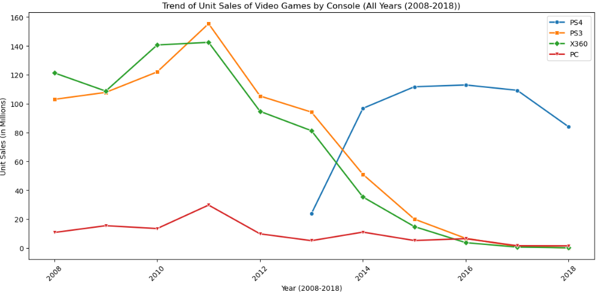
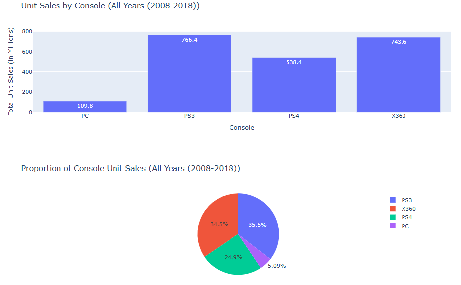
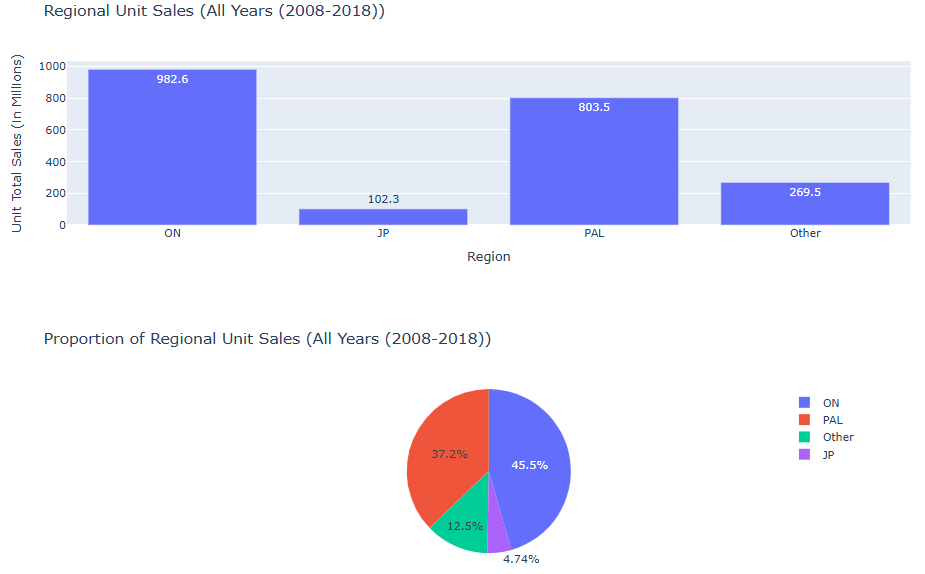
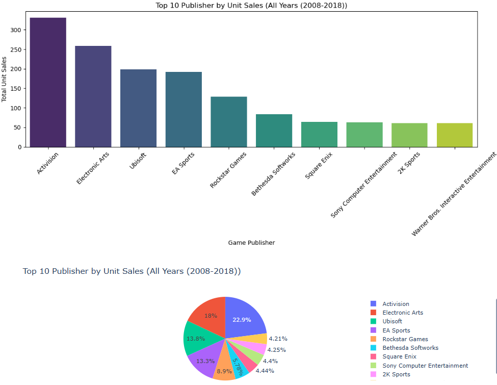
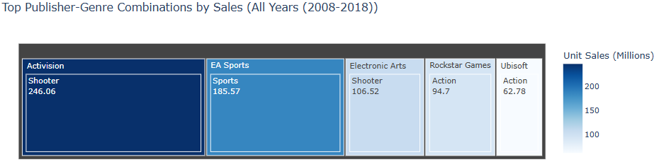
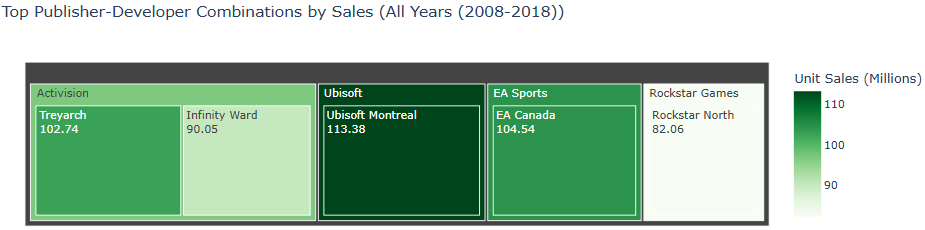

# Introduction
This project analyzes video game unit sales from 2008 to 2018, with a focus on four major platforms: PlayStation 3 (PS3), PlayStation 4 (PS4), PC, and Xbox 360 (X360). The dataset was sourced from Maven Analytics (https://mavenanalytics.io/data-playground?page=3&pageSize=5). While the dataset includes records extending up to 2024, the majority of data entries beyond 2018 are incomplete or blank. Therefore, this analysis is limited to the 2008–2018 period to ensure data accuracy and relevance.
The objective of this project is to simulate the perspective of an investor in 2019 aiming to make informed, profit-driven decisions. By evaluating historical sales trends across platforms, publishers, and developers, this analysis aims to identify the most promising combinations for future investment in the video game industry.
#Tools Used
- **Python (Pandas, Seaborn, Matplotlib, Plotly):** Data manipulation, visualization
-	**SQL (PostgreSQL):** Utilized as the primary tool for data extraction and analysis. SQL queries were integrated into Python scripts to streamline the analysis workflow. This is to understand the equivalent of SQL-to-PANDAS. Mirroring the SQL logic to Pandas operations.
-	**Jupyter Notebook:** Execution environment
-	**Git & GitHub:** Employed for version control, collaboration, and sharing the project in a structured and reproducible format.

# 📈 Analysis Breakdown

### 1. 📉 **Yearly Unit Sales Trend by Console**
- PS3 and X360 showed strong sales early (2008–2012) but declined after.
- PS4 grew steadily from 2013, peaking around 2017.
- PC maintained a lower but stable performance.

*Line chart showing the unit sales trend.*

### 2. 📦 **Total Unit Sales by Console**
- PS4 leads in cumulative sales (2008–2018), followed by PS3 and X360.
- PC ranks lowest in sales, reflecting niche market share.

*Bar and Pie chart showing the comparison and proportion of Unit sales by Console*

### 3. 🌍 **Regional Sales Distribution**
- North America had the highest sales overall.
- Followed by Europe (PAL), then Japan and Other regions.
- Indicates strong Western market dominance—critical for investment focus.

*Bar and Pie chart showing the comparison and proportion of Unit sales in Regions*

### 4. 🏆 **Top 10 Publishers by Unit Sales**
- Dominated by major publishers like **Activision**, **Electronic Arts (EA)**, and **Ubisoft**.
- These companies consistently released top-selling games.

*Bar and Pie chart showing the comparison and proportion of Unit sales made by Publishers*

### 5. 🎮 **Top 5 Publisher-Genre Combinations**
- High-performing combinations include: EA → Sports, Activision → Shooter.
- Useful in aligning investment to genre trends per publisher.

*Treemap showing the Top 5 Genre-Publisher*

### 6. 🧑‍💻 **Top 5 Publisher-Developer Combinations**
- Identifies developer teams with strong performance under top publishers.
- Insightful for ROI-focused development partnerships.

*Treemap showing the Top 5 Developer-Publisher*

## ✅ Final Recommendation (2019 Perspective)
Based on sales data from 2008 to 2018, the most strategic investment for 2019 is in **PS4 video games**, specifically titles from top publishers such as **EA** or **Activision**, focusing on the **Shooter**, **Sports**, or **Action** genres, and targeting Western regions like **North America** and **Europe**, where demand has been consistently strong and returns most promising.


# Here's the python script use for data manipulation and visualization.
```python
import pandas as pd
import matplotlib.pyplot as plt
import seaborn as sns
import plotly.express as px
import plotly.graph_objects as go
from ipywidgets import widgets
from ipywidgets import Output
from IPython.display import display
from IPython.display import clear_output


# Load and prepare the data
file_path = r"D:\Project\Python_Project\vgcharts_2024.csv"
df = pd.read_csv(file_path)
df['release_date'] = pd.to_datetime(df['release_date'], errors='coerce')  #This is to extract the year in release_date. Focusing on yearly performance
target_consoles = ['PS3', 'PS4', 'X360', 'PC']                            #Minimizing the target console to PS3, PS4, X360 and PC.

# Generate year options
years = sorted(df['release_date'].dt.year.dropna().unique())
years = [year for year in years if 2008 <= year <= 2018]                  #Only from year 2008 to 2018 will be included in dropdown.
years_dropdown = ['All Years (2008-2018)'] + sorted(years, reverse=True)

fig_title=go.Figure()
fig_title.add_trace(go.Scatter(
    x=[0],
    y=[0],
    text=["Video Games Unit Sales (2008 to 2018)"],
    mode="text",
    textfont=dict(size=24, color="white")
))

fig_title.update_layout(
    paper_bgcolor="black",
    plot_bgcolor="black",
    xaxis_visible=False,
    yaxis_visible=False
)

fig_title.show()

# Widgets
year_dropdown = widgets.Dropdown(
    options=years_dropdown,
    value='All Years (2008-2018)',
    description='Year:'
)

update_button = widgets.Button(description="Update Dashboard")
output = Output()

# Plotting function
def update_plot(_):
    with output:
        clear_output(wait=True)

        # Data Filtering
        filtered_df = df[
            df['release_date'].dt.year.between(2008, 2018) &            #Cleaning the data by minimizing the year. Include only year 2008 to 2018
            df['total_sales'].notnull() &                               #Removing the null data in total_sales.
            df['console'].isin(target_consoles)                         #See target_consoles above.
        ].copy() #Prevent modifying the original Dataframe

        
        # Additional filter for specific year
        selected_year = year_dropdown.value
        if selected_year != 'All Years (2008-2018)':
            filtered_df = filtered_df[filtered_df['release_date'].dt.year == selected_year]
       
        # 1-6 Data Aggregations
        # 1. Unit Sales by Console
        sales_by_console = filtered_df.groupby('console')['total_sales'].sum().reset_index()

        # 2. Unit sales by regions
        region_sales = {
            'NA': filtered_df['na_sales'].sum(),       #North America Region
            'JP': filtered_df['jp_sales'].sum(),       #Japan Region
            'PAL': filtered_df['pal_sales'].sum(),     #Europe Region and other country uses a PAL TV format
            'Other': filtered_df['other_sales'].sum()} #Other region
        region_df = pd.DataFrame.from_dict(region_sales, orient='index', columns=['total_sales']).reset_index()
    
        # 3. Yearly Unit Sales by Console
        
        yearly_console_performance = filtered_df.groupby(['console', filtered_df['release_date'].dt.year.rename('Year')]).agg(
        total_sales=('total_sales', 'sum')).reset_index()
        
        # 4. Top 10 Unit Sales made by Publisher
        publisher_sales = filtered_df.groupby('publisher')['total_sales'].sum().reset_index().sort_values('total_sales', ascending=False).head(10)
        # 5. Top 5 Genre Unit Sales with Publisher's name
        publisher_genre_sales = filtered_df.groupby(['publisher', 'genre'])['total_sales'].sum().reset_index().sort_values(
            'total_sales', ascending=False).head(5)
        # 6. Top 5 Developer Unit Sales with Publisher's name
        publisher_developer_sales = filtered_df.groupby(['publisher', 'developer'])['total_sales'].sum().reset_index().sort_values(
            'total_sales', ascending=False).head(5)
            

        plt.figure(figsize=(12, 6))
        sns.lineplot(x='Year', y='total_sales', 
                     data=yearly_console_performance[yearly_console_performance['console'] == 'PS4'], 
                     marker='o', label='PS4', color='#1f77b4', linewidth = 2)
        sns.lineplot(x='Year', y='total_sales', 
                     data=yearly_console_performance[yearly_console_performance['console'] == 'PS3'], 
                     marker='s', label='PS3', color='#ff7f0e', linewidth=2)
        sns.lineplot(x='Year', y='total_sales', 
                     data=yearly_console_performance[yearly_console_performance['console'] == 'X360'], 
                     marker='D', label='X360', color='#2ca02c', linewidth = 2)
        sns.lineplot(x='Year', y='total_sales', 
                     data=yearly_console_performance[yearly_console_performance['console'] == 'PC'], 
                     marker='v', label='PC', color='#d62728', linewidth=2)

        plt.xlabel('Year (2008-2018)')
        plt.ylabel('Unit Sales (in Millions)')
        plt.title(f'Trend of Unit Sales of Video Games by Console ({selected_year})')
        plt.xticks(rotation=45)
        plt.legend()
        plt.tight_layout()
        plt.show()
        
        fig_bar1 = px.bar(
        sales_by_console,
        x='console',
        y='total_sales',
        title=f"Unit Sales by Console ({selected_year})",
        text=round(sales_by_console['total_sales'], 1),
        labels={'total_sales': 'Total Unit Sales (in Millions)', 'console': 'Console'}
        )
        fig_bar1.show()
        
        fig_pie1 = px.pie(
        sales_by_console,
        names='console',
        values='total_sales',
        title=f"Proportion of Console Unit Sales ({selected_year})",
        hover_data=['total_sales'],
        labels = {'total_sales': 'Unit Sales (in Millions) by Publisher'})
        fig_pie1.show()
     
        # 2. Region Sales Plot
        fig_bar2 = px.bar(
        region_df,
        x='index',
        y='total_sales',
        text=round(region_df['total_sales'], 1),
        title=f"Regional Unit Sales ({selected_year})",
        labels={'total_sales': 'Unit Total Sales (in Millions)', 'index': 'Region'}
        )
        fig_bar2.show()

        fig_pie2 = px.pie(
        region_df,
        names='index',
        values='total_sales',
        title=f"Proportion of Regional Unit Sales ({selected_year})",
        hover_data=['total_sales'],
        labels = {'total_sales': 'Unit Sales (in Millions) by Publisher'})
        fig_pie2.show()

        plt.figure(figsize=(12, 6))
        sns.barplot(
            x='publisher', 
            y='total_sales', 
            data=publisher_sales, 
            palette='viridis',
            hue = 'publisher'
            )
        plt.xlabel('Game Publisher')
        plt.ylabel('Total Unit Sales')
        plt.title(f"Top 10 Publisher by Unit Sales ({selected_year})")
        plt.xticks(rotation=45)
        plt.tight_layout()
        plt.show() 

        fig_pie3 = px.pie(
        publisher_sales,
        names='publisher',
        values='total_sales',
        title=f"Top 10 Publisher by Unit Sales ({selected_year})",
        hover_data=['total_sales'],
        labels = {'total_sales': 'Unit Sales (in Millions) by Publisher'})
        fig_pie3.show()

        fig_treemap = px.treemap(
        publisher_genre_sales, 
        path=['publisher', 'genre'], 
        values='total_sales',
        title=f"Top Publisher-Genre Combinations by Sales ({selected_year})",
        hover_data={'total_sales': ':.1f'},  # Show 1 decimal place
        labels={'total_sales': 'Unit Sales (Millions)'},
        color='total_sales',  # Color intensity by sales
        color_continuous_scale='Blues'  # Color gradient
        )
        fig_treemap.update_traces(
            textinfo="label+value"  # Show publisher + sales in boxes
        )
        fig_treemap.show()

        fig_treemap2 = px.treemap(
        publisher_developer_sales, 
        path=['publisher', 'developer'], 
        values='total_sales',
        title=f"Top Publisher-Developer Combinations by Sales ({selected_year})",
        hover_data={'total_sales': ':.1f'},  # Show 1 decimal place
        labels={'total_sales': 'Unit Sales (Millions)'},
        color='total_sales',  # Color intensity by sales
        color_continuous_scale='Greens'  # Color gradient
        )
        fig_treemap2.update_traces(
            textinfo="label+value"  
        )
        fig_treemap2.show()

        

update_button.on_click(update_plot)


display(year_dropdown, update_button, output)
update_plot(None)  # Show initial chart for "All Years"
```
